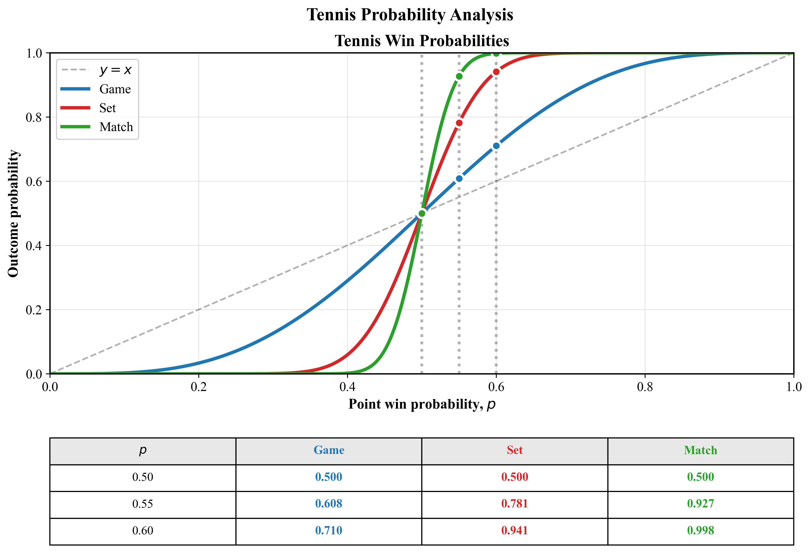

# Tennis Markov Chain Model

## Introduction

Ever wondered why some tennis matches are so even that end up going to a final tiebreak in a best of 5 match, while other matches are mildly dominated by one player but end 'quickly' in straight sets? 
Tennis is a game of statistics and one of the main statistics is total points won in a match. Its is fairly even in general and typically a player wins 40-60% of points in a match. But how does that number translate to winning the match? In other words, how does the probability of winning a point affect the probability of winning a match?

We aim to answer this question with a mathematical model called Markov Chains, and under certain assumptions, we will arrive at a final expression for the probability of winning a match.

We will use Markov chains to model tennis match probabilities at every level of the game hierarchy: points → games → sets → matches.

**The place to start in this repo is the file called `./theory.md`, which describes how tennis can be modeled as a Markov Chain and explains relevant results.**

Next, it is recommended to review and execute the file `./src/main.py` which leverages functions written in `./src/tennis_markov/helpers.py` that compute the analytical solution for the probability of winning a tennis match given the probability of winning a point. 


### The Tennis Hierarchy

Tennis has an interesting hierarchical structure that creates **amplification effects**, detailed in `./theory.md`:

```
Points → Games → Sets → Matches
```

## Mathematical Approach

### Markov Chain Modeling

Each level of tennis is modeled as an absorbing Markov chain, which model Markov Chains that have terminal state/s (in this case a player winning a game, set or match).

1. **Game Level**: States include regular scores (0-0, 15-0, etc.), deuce, advantage, and terminal states.
2. **Set Level**: States represent games won in a set (0-0 through 6-6, tiebreak).
3. **Match Level**: States track sets won (supports both best-of-3 and best-of-5).

The hierarchical nature of tennis creates a natural composition of Markov chains, where the absorption probabilities at one level become the transition probabilities at the next level. Please see `./theory.md` for more details.


### Main result

The main result of this analysis is shown in the next figure. The effect of the probability of winning an individual point is amplified as games build into sets and sets into matches. This implies that if a player wins about 4 out of 10 points, which may not seem too bad, he/she/they has less than 1% chance of winning a 5-set match.



With a 60% point win probability, Player 1's chances become:

| Level | Win Probability |
|-------|-----------------|
| **Point** | 55.0% |
| **Game** | 60.8% |
| **Set** | 78.1% |
| **Match (Bo5)** | 92.7% |

This demonstrates the **compound advantage** effect in tennis: only winning 55 out of 100 points gives you great odds of winning the match!


## Project Structure

```
tennis_as_a_markov_chain/
├── data/
├── src/
│   ├── main.py/
│   ├── game_set_match.py/
│   └── tennis_markov/
│       ├── __init__.py
│       └── helpers.py      # Core Markov chain implementation
├── .pre-commit-config.yaml
├── pyproject.toml
├── README.md
├── theory.md
└── uv.lock
```

## Quick Start

### Usage

```bash
# Clone the repository
git clone https://github.com/<yourusername>/tennis_as_a_markov_chain.git
cd tennis_as_a_markov_chain

# Install dependencies (automatically creates virtual environment)
uv sync

# Run the analysis
uv run python -m ./src/main.py
```

## References

- Pinsky, M. A., & Karlin, S. (2011). An introduction to stochastic modeling (4th ed.). Academic Press.


## Contributing

Contributions/feedback are most welcome. Some natural extensions of this approach include:

- **Enhanced Tiebreak Modeling**: More detailed state representation for tiebreaks. Currently, I set the probability of winning a tiebreak equal to that of winning a game.
- **Serving Advantage**: Separate probabilities for serving vs. receiving points.
- **Real Data Integration**: Fit model parameters to actual tennis statistics.
